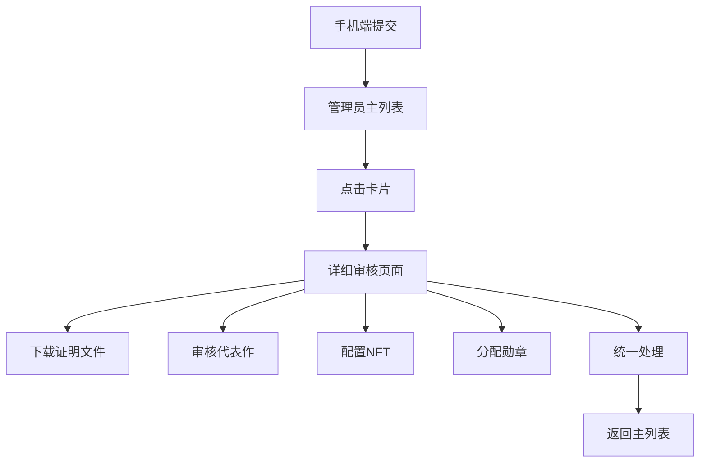

# 🎨 BrokerWallet 新界面设计说明

## 📋 设计理念

基于用户在手机端提交**证明文件 + NFT图片 + 代表作**的完整流程，重新设计了管理员审核界面，将所有相关功能整合到一个统一的审核流程中。

## 🔄 新的工作流程

### 📱 **用户端提交（brokerwallet-academic）**
用户在手机应用中一次性提交：
- 📄 证明文件（必须）
- 🖼️ NFT图片（可选）
- 📝 代表作描述（可选）
- ✅ 是否同意展示代表作

### 💻 **管理员端审核（重新设计）**

#### 🏠 **主列表界面** (`/admin/medal-distribution`)

**显示内容：**
- 📊 所有待审核材料的卡片列表
- 👤 用户信息（显示名称、钱包地址）
- 📁 文件信息（文件名、大小、提交时间）
- 📊 审核状态徽章

**交互功能：**
- 🖱️ **点击卡片** → 进入详细审核页面
- 📥 **快速下载** → 直接下载证明文件
- ⚡ **快速操作**：
  - 🥇 一键分配金牌
  - 🥈 一键分配银牌  
  - 🥉 一键分配铜牌
  - ❌ 快速拒绝

#### 📋 **详细审核界面** (`/admin/material-detail/:id`)

**功能模块：**

1. **👤 用户基本信息**
   - 钱包地址、显示名称、提交时间
   - 清晰的信息展示卡片

2. **📄 证明文件管理**
   - 文件详细信息（名称、大小、类型）
   - 📥 下载按钮

3. **🎯 用户代表作审核**
   - 📖 显示用户提交的代表作内容
   - 🔘 管理员同意/拒绝展示的开关
   - 💾 保存审批决定

4. **🖼️ NFT图片处理**
   - 如果用户上传了图片：显示预览
   - 如果用户未上传：提示将使用自动生成

5. **🏅 勋章分配**
   - 金、银、铜牌数量输入
   - 直观的数字输入框

6. **🎨 NFT铸造配置**
   - NFT名称和描述设置
   - 铸造选项：
     - **使用用户图片**：如果用户上传了图片
     - **自动生成勋章**：使用系统生成的勋章图片
   - 自动生成配置（作者、事件类型、贡献等级等）

7. **⚡ 统一操作**
   - ✅ **审核通过并处理**：同时完成勋章分配和NFT铸造
   - ❌ **审核拒绝**：拒绝整个提交

## 🎯 界面优化亮点

### 📐 **尺寸和字体优化**
- **侧边栏宽度**：220px → 280px
- **字体大小**：全面提升到16-18px
- **按钮尺寸**：使用x-large尺寸
- **卡片padding**：增加到25-35px
- **标题字体**：28-32px大标题

### 🎨 **视觉效果提升**
- **渐变背景**：现代化的渐变色彩
- **悬停动画**：卡片上浮、阴影变化
- **状态徽章**：彩色圆角标签
- **图标丰富**：每个功能都有对应的emoji图标

### 🚀 **交互体验改进**
- **一键操作**：快速分配单个勋章
- **点击卡片**：直接进入详情页面
- **智能默认值**：自动填充NFT名称和描述
- **实时反馈**：操作结果即时显示

## 📱 **响应式设计**

### 🖥️ **桌面端**
- 宽屏布局，信息展示充分
- 多列表单，提高操作效率

### 📱 **移动端**
- 自动调整为单列布局
- 按钮变为全宽显示
- 保持所有功能可用

## 🔗 **数据流程**

## 🎪 **功能整合优势**

### ✅ **之前的问题**
- 功能分散在多个页面
- NFT铸造与审核流程分离
- 需要多次操作才能完成审核

### 🎯 **现在的优势**
- **一站式审核**：所有功能在一个页面完成
- **流程简化**：点击卡片即可进入详细审核
- **智能配置**：根据用户提交自动配置NFT
- **快速操作**：支持一键分配和批量处理

## 🚀 **使用方式**

1. **访问主列表** → 查看所有待审核材料
2. **点击材料卡片** → 进入详细审核页面
3. **审核所有内容** → 证明文件、代表作、NFT配置
4. **统一处理** → 一键完成勋章分配和NFT铸造
5. **自动返回** → 处理完成后返回主列表

这个新设计完全符合用户在手机端的提交流程，让管理员的审核工作更加高效和直观！🎉

